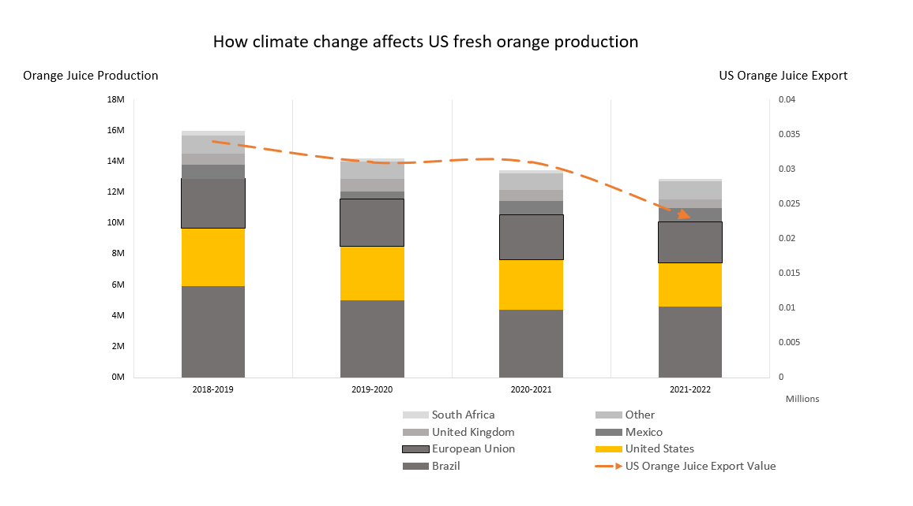

| [home page](https://luyi-sss.github.io/tswd-portfolio-luyi/) | [visualizing debt](visualizing-government-debt) | [critique by design](critique-by-design) | [final project I](final-project-part-one) | [final project II](final-project-part-two) | [final project III](final-project-part-three) |

# Critique by design

## The original data visualization & some background information
The original data visualization is from an article in the Financial Times, and it is called: [Soft commodities: orange juice gives a taste of coming volatility](https://www.ft.com/content/9619df30-cdf7-49ee-abf3-6583f2b0bcf9)
This article is about the extreme weather and El Niño leading to a decrease in US fresh orange production, therefore the price of US orange juice surges. 

The reason why I chose it and what I gained from the critique method:  
Everyone from corporate executives, investors, policymakers, academics, to consumers could be audiences for this tool as it is published in the Financial Times. Audiences are generally intellectual and professional; they may have sufficient knowledge about this topic and are highly interested in this. Even if audiences don't have specific knowledge about the annual production and specific production countries of oranges, their good education and professionalism enable them to quickly understand the information when they see the chart. They want to gain high-value information efficiently from data visualization so they can quickly catch up with the context. However, this visualization is not effective.
   
1. This chart is not intuitive and does not give support for the context: the title is called “Falling US production is pushing prices higher’, but the price is vague as there are two prices on the y-axis. One is the price of fresh orange juice, the other is the frozen orange juice. The title only mentions price changes without specifying which price. This doesn’t assist the audience in better understanding the chart. Also, the chart suggests that a decrease in US orange juice production has led to an increase in the price of frozen orange juice. However, from the chart, we can see that global orange juice production has been declining since 2018. Moreover, Brazil is the largest orange juice-producing country, and solely from this chart, we cannot ascertain that the US is the primary producer affecting the price of frozen orange juice. Furthermore, based on the annotations below the chart, I searched for data and found a discrepancy in the orange production figures for the EU and Mexico as presented in the chart. In the original dataset, fresh orange production in the EU consistently exceeded that of Mexico, whereas in the chart, it is depicted the other way around.
   
2.	It is unclear and fails to communicate with audiences: Based on the content of the entire article, the author's main point is the significant impact of climate change on U.S. orange production in recent years. In the chart, the author does not specifically highlight U.S. production, which distracts readers' focus. Different colors are used to represent different countries, and since Brazil is the largest producer of oranges, the U.S. segment on the chart is relatively small and not prominent. Readers would need to spend a considerable amount of time locating the part of the chart that pertains to the United States. Additionally, the trendline for frozen orange juice price changes is the most prominent part of the chart. I initially thought this line might represent the overall trend in global orange production, but it's evident that I misunderstood. Additionally, I am somewhat puzzled by the story that this chart seems to want to tell. According to the title and the context, it intends to discuss changes in U.S. orange production and prices, but this is a chart with a global focus. In terms of the main part of the chart, the variation in fresh orange production could be better corresponding to changes in fresh orange prices, but the chart uses frozen orange prices, which I find somewhat challenging to comprehend. If the chart wants to present global production, why does the title focus solely on the United States? Also, the author doesn’t mention frozen juice prices in the article, so I don’t think it is informative to graph a line about the price change it. It won’t help readers to understand the article better.
  
4.	It is not aesthetically engaging for audiences: Firstly, the focus of this chart is unclear. If I were to create this chart, I would present two metrics: orange production in the United States and how it affects U.S. fresh orange juice prices. The use of a stacked bar chart and a line chart seems reasonable, as they give comparisons and the trend that changed over time. I don't intend to change that. The legend is distracting because it is large and is in the top left corner, which is the visual focus of readers while reading data visualizations. 

## Modifications that I would like to make: 
I will replace the frozen orange juice prices with fresh orange juice prices for easy understanding.
Also, I will change the chart's title, color usage, legend, fonts and font sizes, and gridlines.
I would change the title to 'The Decreasing of US Production and the Increasing of Prices'. As a reader, I think the chart uses too many colors, and the chosen colors are not aesthetically pleasing. Since my focus is on the change in U.S. orange production, I would use varying shades of gray to represent regions other than the United States in the bar chart, with the United States depicted in orange. Additionally, in the line chart, I would change the curve representing U.S. fresh orange juice prices to a smoother line and use yellow color. The legend is distracting because it is large and is in the top left corner, which is the visual focus of readers while reading data visualizations. I would relocate the legend to the right or below the chart and reduce the font size to avoid drawing too much attention from the readers. I would try to retain the gridlines on the y-axis to allow readers to quickly estimate approximate values. I would also reduce the annotations on the y-axis to make the chart look more concise. Perhaps I would consider adding one or two annotations to the chart to highlight some key insights.

## My first draft

##Feedback of My First Draft: 
- What can you tell from the data visualization?
- Can you describe to me what information you gained from it?
- Is there anything you find confusing?
- Is there anything you would change or do differently?
- Who do you think is the intended audience for this?

Feedbacks I got:
- student, mid 20's
1. This chart is about the change in orange production. One change can be seen over time and the other change is based on regions. So the chart is basically saying how climate change affects orange juice production.
2. The magnitudes of the two y-axes are significantly different.
3. But I failed to understand the meaning of 2 y-axis.
4. The different shades of grey make it hard to tell productions of regions other than the US.
5. I cannot get the emphasis on US production.
6. Now the line chart looks like a line to depict the trend of the bars, why don't you change the values of the right y-axis and try to move the US values to the bottom of the bars to make it more obvious?

- student, early 20's
1. I misunderstood the legend, I thought it was a part of the bar chart.
2. The different shades of grey make it hard to tell productions of regions other than the US.
3. The title is aligned with the information you want to tell in the charts.
4. 2 y-axis values are difficult to understand, and they don't have the same format.
5. A bit hard to see the US production is going down
6. Delete the arrow of the line chart.
7. The word choice of 'US orange juice export value' is confusing for me.

- feedback from class
1. The different shades of grey make it hard to tell productions of regions other than the US.
2. Does the sequence of grey matter? What about using different colors for other producers?
3. Maybe only 2 segments are needed? One is the US, the other is "other regions except the US"?

## What did my re-designed data visualization show, and what did I attempt to do differently? 
What did I show:
I would like to present the changes in US orange production over the past five years and the fluctuations in US orange juice prices through data visualization. This will serve as a supplementary section to the original content, providing a visual representation of how the changes in US orange production have affected US orange juice prices.
By utilizing a bar chart, we can compare the changes in production over the past five years, while an associated line chart will reveal the trend in price fluctuations during this same period. Additionally, within the bar chart, different segments represent the production levels of the major orange juice-producing regions for each year. The color orange will signify the United States, while other countries will be represented by varying shades of gray, with lighter shades indicating lower production volumes.

what did I do:
1. Download fresh orange juice production data from [USDA](https://www.fas.usda.gov/data/citrus-world-markets-and-trade). Because the dataset contains fruit products besides orange juice, I extracted orange juice data from the original dataset and used the Pivot table to do some basic calculations.
2. Download fresh orange juice price data from [Markets Insider](https://markets.businessinsider.com/commodities/orange-juice-price) because I didn't find it on USDA (I guess it is the reason why the original data visualization used the frozen orange juice price data. On USDA, they only have the frozen orange juice prices.)
3. Combine two tables into one and upload it on Flourish.
4. I followed the suggestions I collected to revise my draft. I changed the title, the format of the line chart, the y-axis, colors, and some annotations.
5. However, I keep the legend on the bottom because I found it distracting when I put it above. I continue to use grey(if any reader is interested in comparing productions of other countries, different shades of grey can help them identify it) and orange to differentiate different regions as I want my readers to focus on the US part. Data from other countries are not that important in this visualization(but they are necessary to compose a complete chart.)

# Final data visualization:

