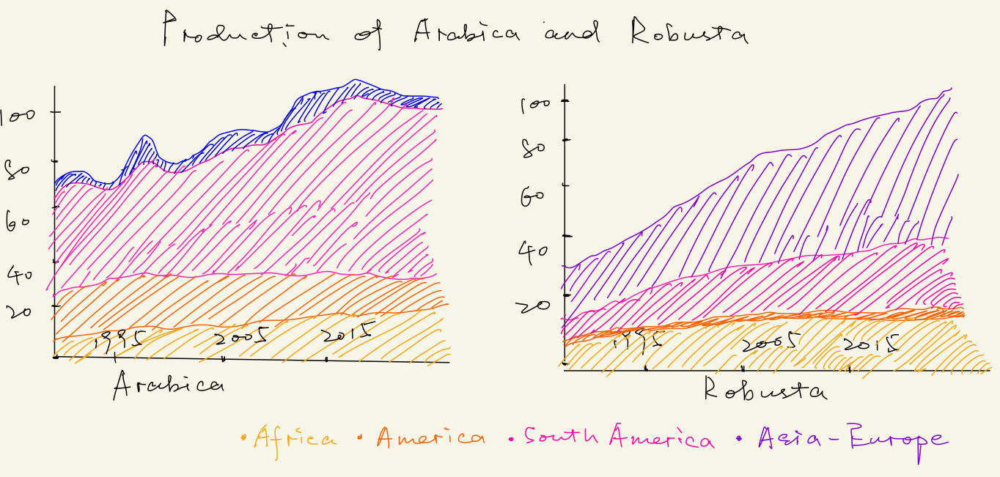

| [home page](https://cmustudent.github.io/tswd-portfolio-templates/) | [visualizing debt](visualizing-government-debt) | [critique by design](critique-by-design) | [final project I](final-project-part-one) | [final project II](final-project-part-two) | [final project III](final-project-part-three) |

## Outline

In general, the structure of my story would be:
1. the background information about coffee and the issue of decreasing production due to climate change (data viz: a stacked area chart and a line chart)
2. how the climate change affect the planting environment and coffee growers (data viz: stacked bar chart, line chart, and map)
3. strategies to save the future of the coffee industry (data viz: table)

* the types and numbers of charts are not the final plan.

> Following is the summary of my story:  

Are We Running Out of Coffee?  

Coffee is one of the most popular drinks around the world. Every year, we consume more than 12 billion pounds of coffee and the United States alone has over 130 million coffee drinkers.(Wikipedia, _Economics of Coffee_ 2023) The demand for coffee has been steadily increasing over the past three years and is expected to continue rising in the future. 

However, coffee production has been declining year by year due to climate change. The rising temperatures from global heating decreased suitable lands for cultivating coffee. Also, the climate conditions reduce coffee yield becoming more frequent. According to the research by Dr Doug Richardson, lands are "shifting from cool and wet to hot and dry conditions. We’re pretty confident is a result of climate change. We suggest that coffee production can expect ongoing systemic shocks"(The Guardian, 2023)This means in the near future, drinking coffee would be a luxury.

How does climate change affect coffee production?  
I. The limited plant regions and vulnerability of coffee beans  
The coffee belt runs horizontally along it, spanning 25 degrees north and 30 degrees south of the equator, which means the tropical areas are the traditional regions planting coffee beans. Brazil, Vietnam, Colombia, Ethiopia, and Indonesia are the major coffee producers but we can their best areas for plating coffee trees are narrowing due to the frequent extreme weather as coffee trees love places that are not too cold but not too hot.

Arabica and Robusta are the 2 major coffee beans we consume every day with the arabica beans favored by most consumers. Arabica bean is particularly vulnerable to warming weather and fungus, which can ruin the harvest of coffee beans. But it provides the familiar coffee scent that we taste every day. Meanwhile, the Robusta is tougher compared to Arabica but it does not give a pleasing taste. If the weather changes significantly, Robusta beans are also vulnerable. The harvest of coffee beans heavily depends on the weather. 

II. Growers are leaving the industry  
Due to their precarious position in the value chain, most growers are unable to directly address the climate crisis. Poverty among growers is widespread. Of the estimated 25 million farmers across 50 "coffee belt" countries, about 80 percent are smallholder producers struggling with low incomes, working on plots of land of less than five hectares. Many of these farmers, already grappling with low incomes, now find themselves on the front lines of the climate crisis, with changing weather patterns leading to droughts, floods, and increased pest and disease pressure. Many feel that they are bearing the brunt of the climate burden without receiving adequate compensation and are opting to leave the industry.
According to data from the World Intellectual Property Organization, a UN agency, producing countries retain less than 10 percent of the estimated $200 billion annual coffee industry's retail value, while large companies headquartered in higher-income importing countries capture most of the profits.

Organizations associated with the coffee industry are mobilizing efforts to secure the coffee industry's long-term future.  
The World Coffee Research (WCR) advocates for increased financial investment in agricultural research to support research in developing more resilient coffee plants, improving disease and pest control, implementing innovative water and natural resource protection methods, enhancing soil health, and promoting best practices in farm management. Brazil, Vietnam, and Colombia have invested in farm technology and climate-resistant plants.

In addition to agricultural research and development, improved access to marketing and the utilization of technology, like DNA fingerprinting to identify coffee varieties for roasters, can contribute to boosting productivity and prices. Further support for these strategies, along with better access to financial resources and credit mechanisms, will help bridge the gap between coffee production and consumption. To rescue the coffee industry, a renewed emphasis on culture, history, and the stories behind coffee farming, similar to the approaches seen in the cheese and wine industries, is essential. The coffee sector should create compelling narratives that highlight the intangible aspects of coffee origins, human experiences, and ecological stories.  

## Initial sketches
> the story arc 

> coffee consumption surpassed production 

> climate change affects Arabica beans more, which are the type we consume the most.

> major coffee producers

> most profits goes to coffee retail companies rather than coffee growers

# The data
> An explanation of how I plan on using my data:

Story reference: articles that I list will be used as reference to outline my story.
  
Data reference:
- the coffee domestic consumption table: creates the stacked area chart to illustrate the trend and proportions of global coffee consumption.
- the coffee domestic consumption table & production table: the coffee industry is facing a serious challenge due to climate change as consumption surpasses production.
- the production of 2 major coffee beans: the production growth rates of Arabica and Robusta are both slowing down. In the near future, we will witness a decrease in production. (Coffee will be expensive.)
- the production of 2 major coffee beans: make a comparison of the production of Arabica and Robusta beans to show Arabica gets affected more. (We will have less tasty coffee.)
- the price paid to growers & the retail price: make a comparison in order to show how less profits the growers can get.
  

| Name                               | URL                                                                                                                                                | Description     |   |   |
|------------------------------------|----------------------------------------------------------------------------------------------------------------------------------------------------|-----------------|---|---|
| Wikipedia-coffee                   | [Wikipedia-coffee](https://en.wikipedia.org/wiki/Economics_of_coffee#:~:text=Twelve%20billion%20pounds%20of%20coffee,over%20130%20million%20coffee%20drinkers).        | Story Reference |   |   |
| Financial Times                    | [Financial Times ](https://ig.ft.com/coffee/).                                                                                                                          | Story Reference |   |   |
| The Guardian                       | [The Guardian](https://www.theguardian.com/environment/2023/mar/09/rising-temperatures-in-tropics-to-lead-to-lower-coffee-yields-and-higher-prices-study-suggests). | Story Reference |   |   |
| Coffee Production                  | [Coffee Production](https://www.ico.org/prices/po-production.pdf).                                                                                                       | Data Reference  |   |   |
| Coffee Consumption                 | [Coffeee Consumption](https://www.ico.org/new_historical.asp?section=Statistics).                                                                                          | Data Reference  |   |   |
| Coffee Prices Paid to Growers      | [Coffee Prices Paid to Growers](https://www.ico.org/new_historical.asp).                                                                                                             | Data Reference  |   |   |
| Production of 2 major coffee beans | [Production of 2 major coffee beans](https://www.ico.org/prices/new-consumption-table.pdf)                                                                                               | Data Reference  |   |   |
| Coffee Retail Price                | [COffee Retail Price](https://www.ico.org/new_historical.asp?section=Statistics).                                                                                          | Data Reference  |   |   |

# Method and medium
> In a few sentences, you should document how you plan on completing your final project. 

I am using my iPad and Excel to help me sketch my drafts. In part 2 and part 3, I would create target audience personas and a moodboard to better tell my story. Also, user research is a method I would use. Final data visualizations and the storyboard will be delivered via Tableau and Shorthand.
